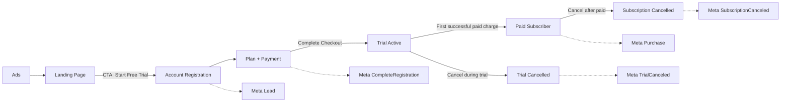

# Pilates Anytime — Data Map

**Client:** Pilates Anytime  
**Organization:** Matchnode  
**Channel in scope:** Meta (Facebook / Instagram)  
**Primary conversion path:** Paid ad → landing page → 15-day free trial checkout  
**Trial length:** 15 days  
**Plans after trial (USD, website):** Monthly $24/mo · Annual $264/yr ($22/mo)

This data map identifies every user-facing step in the paid-acquisition funnel, the system that owns the step, and the Meta event (if any) that should fire. It extends the existing acquisition diagram (Ads → Landing Page → Account Registration → Complete Checkout) with the two post-trial events that were not on that visual: **Purchase** and **Subscription Cancelled**.

---

## End-to-end flow



Solid arrows are user movement. Dashed labels are Meta events.

---

## Step-by-step identification

| # | Step | What the user does | Surface / URL pattern | Trigger for tracking | Meta event | Event type | When it fires |
|---|------|--------------------|------------------------|----------------------|------------|------------|---------------|
| 1 | **Ads** | Sees / clicks a Meta ad | Facebook, Instagram | Ad click (`fbclid` lands on destination) | None (click is platform-native) | — | At ad click. Capture `fbclid` / `_fbc` / `_fbp` for later CAPI matching. |
| 2 | **Landing Page** | Views campaign LP | `/px/*` (e.g. `/px/home-v39`, `/px/begin_strong_challenge_v1`, `/px/core_reset_reformer_challenge_v1`, `/px/Reformer-v10`, `/px/PRO`, `/px/go-to_reformer_challenge_v1`) plus UTM params | Page view | Optional `ViewContent` (not currently specified) | Standard (optional) | On LP load. Not required for the stated event set. |
| 3 | **CTA Click** | Clicks **Start Free Trial** / **Start 15-Day Free Trial** | Same LP | Button click → redirect | None | — | Navigation only. Do **not** fire Lead here. |
| 4 | **Account Registration** | Fills **first name, last name, email, password**, agrees to Terms, clicks Continue | `/account/new_account.cfm` | Successful, valid account-create submit | **Lead** | Standard | After personal information is accepted and the account is created — **before** payment. |
| 5 | **Plan + Payment** | Selects Monthly or Annual, enters payment method (card / PayPal / etc.) | Checkout / plans + payment step after registration | Form progress | Optional `InitiateCheckout` / `AddPaymentInfo` (not currently specified) | Standard (optional) | Progress events only. Do **not** fire CompleteRegistration until checkout succeeds. |
| 6 | **Complete Checkout** | Clicks **Complete Checkout** with valid plan + payment | Checkout confirmation | Successful trial start (payment method stored, trial begun, $0 charged) | **CompleteRegistration** | Standard | On successful checkout click / trial-start confirmation — **not** on first paid invoice. |
| 7 | **Trial period** | Uses membership for 15 days | Product / app | No conversion | None | — | Access is active; billing has not occurred. |
| 8 | **First paid conversion** | Trial ends and the stored payment method is charged **for the first time** | Billing / subscription backend | First successful paid invoice after trial | **Purchase** | Standard | Server-side, on first successful charge only. Include `value` + `currency`. Do **not** fire at checkout if the charge is $0. |
| 9a | **Trial cancelled** | Cancels during the 15-day trial (before first charge) | My Account → Subscription & Payment → Cancel Subscription | Cancellation confirmed while still on trial | **TrialCanceled** (`TrialCanceled CC`) | Custom (`OTHER`) | When trial is cancelled and no first paid charge will occur. |
| 9b | **Subscription cancelled** | Cancels after becoming a paying subscriber | Same account UI (or Apple / Google / Roku if signed up in-app) | Cancellation confirmed on a paid subscription | **SubscriptionCanceled** (`SubscriptionCanceled CC`) | Custom (`OTHER`) | When a paying subscription is cancelled. Keep this distinct from trial cancel. |

---

## Event dictionary (Meta)

### 1. `Lead` — account created

| Field | Spec |
|--------|------|
| **Business meaning** | User submitted personal information and an account exists. Soft conversion / top-of-funnel. |
| **User action** | Complete name, email, password on the registration form and continue successfully. |
| **Does not fire on** | CTA click, landing-page view, payment entry, checkout, or login of an existing account. |
| **Recommended `action_source`** | `website` |
| **Recommended identifiers** | Hashed email (`em`), first name (`fn`), last name (`ln`), `fbc`, `fbp`, `client_ip_address`, `client_user_agent`, `external_id` (account id) |
| **Value** | Do not send paid `value` (no money has changed hands). |
| **`event_id`** | Unique per account-create (e.g. `lead_{account_id}`) for pixel/CAPI dedup. |
| **Optimization use** | Volume / prospecting. Not a paid conversion. |
| **Adnova / Events Manager aliases** | Standard Leads; custom conversions **Wicked Leads by Click** / **Wicked Leads by View** |

### 2. `CompleteRegistration` — trial checkout completed

| Field | Spec |
|--------|------|
| **Business meaning** | User started the 15-day free trial: plan selected, payment method stored, checkout completed. |
| **User action** | Click **Complete Checkout** after a valid payment method and plan. |
| **Does not fire on** | Account form submit (that is Lead), first paid invoice (that is Purchase), or failed checkout. |
| **Recommended `action_source`** | `website` |
| **Recommended identifiers** | Same as Lead, plus `external_id`. |
| **Custom data** | `content_name` / `content_ids` = plan (monthly vs annual); `currency`; `value` = `0` (trial). |
| **`event_id`** | Unique per trial-start (e.g. `trial_{subscription_id}`). |
| **Optimization use** | Trial-start campaigns. Higher intent than Lead, still not revenue. |
| **Adnova / Events Manager alias** | Custom conversion **Complete Registration** (`COMPLETE_REGISTRATION`) |

### 3. `Purchase` — first paid charge after trial

| Field | Spec |
|--------|------|
| **Business meaning** | First real revenue: trial converted to a paid subscription. |
| **User action** | None required at the moment of fire — billing processor charges the card when the 15-day trial ends. |
| **Does not fire on** | Complete Checkout (trial), subsequent renewals (unless product later wants `Subscribe` / recurring Purchase), failed charges, or refunds. |
| **Recommended `action_source`** | `website` (or `system_generated` if using Meta’s subscription guidance) |
| **Required custom data** | `value` = amount charged (e.g. `24` or `264`), `currency` (ISO, e.g. `USD`), `order_id` / invoice id |
| **Recommended identifiers** | Hashed email, `external_id`, stored `fbc` from original ad click |
| **`event_id`** | Unique per first invoice (e.g. `purchase_{invoice_id}`). |
| **Optimization use** | True ROAS / paid-subscriber campaigns. |
| **Adnova / Events Manager aliases** | Standard Purchases; Wicked Sales custom conversions (click / view / last-click variants) |

**Rule:** one user should produce **Lead → CompleteRegistration → Purchase** in that order, never Purchase at the same moment as CompleteRegistration.

### 4. `TrialCanceled` — cancelled before first charge

| Field | Spec |
|--------|------|
| **Business meaning** | Trial started, then cancelled so the first paid charge will not happen. |
| **User action** | My Account → Subscription & Payment → **Cancel Subscription** while still in trial. |
| **Meta mapping** | Custom conversion **TrialCanceled CC** (`OTHER`) |
| **Value** | None |
| **Do not also fire** | `SubscriptionCanceled` for the same cancellation. |

### 5. `SubscriptionCanceled` — cancelled after paying

| Field | Spec |
|--------|------|
| **Business meaning** | A paying subscriber cancelled auto-renew. |
| **User action** | Same cancel UI **after** at least one successful paid charge (or equivalent paid state). |
| **Meta mapping** | Custom conversion **SubscriptionCanceled CC** (`OTHER`) |
| **Value** | Optional: remaining term / last invoice; not required. |
| **Note** | Website cancels are first-party. Apple / Google Play / Roku cancels happen off-site; only fire this event if billing webhooks still observe the cancel. |

---

## Data that moves (and what must not)

| Data | Collected at | Stored | Sent to Meta | Notes |
|------|----------------|--------|--------------|--------|
| Click IDs (`fbclid`, `_fbc`, `_fbp`) | Ad landing | Yes, with the user/account | Yes (`fbc`, `fbp`) | Required to attribute Purchase and cancels back to the original ad. Persist through trial. |
| First name, last name, email | Account Registration | Yes | Hashed only (`fn`, `ln`, `em`) | Lead + all later events. |
| Password | Account Registration | Hashed in product DB | **Never** | |
| Payment method / full PAN | Checkout | Processor (token) | **Never** | |
| Plan (monthly / annual) | Checkout | Yes | Optional `content_ids` / `content_name` | |
| Charge amount + currency | First invoice | Billing | Yes on Purchase (`value`, `currency`) | |
| Cancellation reason | Cancel UI | Optional | **No** | |

Pilates Anytime is a fitness subscription, not a HIPAA-covered entity by default. Still hash PII per Meta CAPI rules and never send payment credentials or passwords.

---

## Funnel math (how to read the events)

```
Ad clicks
  → Landing page sessions
    → CTA clicks (Start Free Trial)
      → Lead                    = accounts created
        → CompleteRegistration   = trials started
          → Purchase             = first paid conversions
          → TrialCanceled       = trials that will never pay
          → SubscriptionCanceled = paid members who churn
```

**Useful ratios**

- CTA → Lead: form completion rate  
- Lead → CompleteRegistration: checkout completion rate  
- CompleteRegistration → Purchase: trial-to-paid rate  
- CompleteRegistration → TrialCanceled: trial churn  
- Purchase → SubscriptionCanceled: paid churn  

---

## What was missing from the original diagram

The client visual stopped at Complete Checkout and only showed:

1. Ads  
2. Landing Page  
3. CTA Click  
4. Account Registration → Meta **Lead**  
5. Complete Checkout → Meta **Complete Registration**

The full data map adds:

6. **Plan + payment method** as its own step (user-visible, no required Meta standard event).  
7. **Trial active** (15 days, no Meta conversion).  
8. **Purchase** — first successful payment after the trial.  
9. **TrialCanceled** — cancel during trial (`TrialCanceled CC`).  
10. **SubscriptionCanceled** — cancel after paid (`SubscriptionCanceled CC`).

---

## Implementation notes

1. **Lead is form success, not CTA.** The CTA only redirects to `/account/new_account.cfm`.  
2. **CompleteRegistration is checkout success, not form success.** Payment must be stored and the trial started.  
3. **Purchase is billing, not the Complete Checkout button.** Fire from the subscription/billing system when the first invoice succeeds after day 15.  
4. **Persist click IDs** from the LP through account create, checkout, trial, and first invoice — otherwise Purchase and cancel events will not match back to Meta ads.  
5. **Deduplicate** pixel + CAPI with the same `event_id` per event.  
6. **Do not fire Purchase on renewals** unless product later asks for a separate `Subscribe` or recurring-purchase spec.  
7. **One cancel event per cancellation.** Trial vs paid is mutually exclusive.  
8. **In-app store signups** (Apple, Google, Roku) are a parallel billing path. Website data map above covers the Meta LP → web checkout journey used by current `/px/*` ads.

---

## Source of truth used for this map

- Client-stated journey: Start Free Trial CTA → personal info → payment + plan → Complete Checkout.  
- Client-stated Meta events: Lead on personal info; Complete Registration on Complete Checkout; Purchase on first paid charge after trial; Subscription Cancelled on cancel.  
- Live site: `pilatesanytime.com` homepage and `/account/new_account.cfm` (name, email, password); 15-day trial; monthly/annual plans.  
- Cancel path: My Account → Subscription & Payment → Cancel Subscription.  
- Meta ad destinations currently in use: `/px/*` challenge and home landing pages.  
- Events Manager custom conversions already present: Complete Registration, TrialCanceled CC, SubscriptionCanceled CC, plus Lead and Purchase (Wicked) variants.
