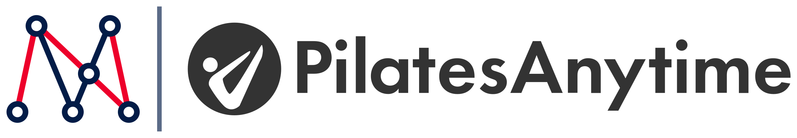

# Matchnode + PilatesAnytime lockup

Co-branded logo lockup pairing the Matchnode node mark with the PilatesAnytime
client logo, separated by the vertical slate rule Matchnode uses for client
co-branding.



## Files

| File | Use |
| --- | --- |
| `dist/matchnode-pilatesanytime-lockup.svg` | Primary lockup. Vector, use wherever SVG is supported. |
| `dist/matchnode-pilatesanytime-lockup-2400w.png` | Transparent PNG for decks and docs. |
| `dist/matchnode-pilatesanytime-lockup-1200w.png` | Transparent PNG for web and email. |
| `dist/matchnode-pilatesanytime-lockup-2400w-white.png` | Flattened on white, for tools that mishandle transparency. |
| `dist/matchnode-pilatesanytime-lockup-reversed.svg` | Reversed (all-white) lockup for dark backgrounds. |
| `dist/matchnode-pilatesanytime-lockup-reversed-2400w.png` | Transparent PNG of the reversed lockup. |

Reach for the SVG by default. The PNGs exist for the places that still refuse
vector artwork.

## Layout

Every dimension is expressed as a multiple of the Matchnode mark height, so the
lockup keeps its proportions at any size.

| Measure | Value |
| --- | --- |
| Matchnode mark height | `1.00` (the reference unit) |
| Gap, mark to rule | `0.16` |
| Rule width x height | `0.042` x `1.16` |
| Gap, rule to client logo | `0.24` |
| PilatesAnytime logo height | `0.86` |
| Rule colour | `#5B6B87` (`#8E9CB3` reversed) |

Two details worth knowing before anyone nudges these numbers:

- The client logo is set to `0.86` rather than matching the mark height because
  its artwork is dominated by a circle, and a circle at equal height reads
  larger than the mark's angular silhouette.
- Vertical alignment centres each element on its inked bounds, which lands the
  PilatesAnytime circle exactly on the Matchnode mark's centre line. The
  descender in "Anytime" happens not to disturb this, since the circle is the
  full height of the source artwork.

## Usage

- Keep clear space of at least half the Matchnode mark height on all sides.
- Minimum width is 320 px on screen. The lockup is close to 6:1, so anything
  narrower leaves the PilatesAnytime wordmark too small to read.
- Do not restack, recolour, or re-space the parts. If the lockup needs to change,
  change `build.py` and regenerate so every export stays in sync.
- Use the reversed lockup on dark backgrounds rather than placing the primary
  lockup on a coloured fill.

## Sources

Both logos are the official published vector files, not traced or rebuilt:

- Matchnode: `src/matchnode-logo-full.svg`, from
  `matchnode.com/wp-content/uploads/2022/06/site-logo.svg`. `build.py` splits out
  the node mark (`src/matchnode-mark.svg`) and discards the wordmark, since the
  lockup pairs the mark alone with the client logo.
- PilatesAnytime: `src/pilatesanytime-horizontal-black.svg`, from
  `images.pilatesanytime.com/graphics/responsive/logo/PAlogo_horizontal_black.svg`.

PilatesAnytime also publishes a white horizontal logo. It is the same geometry
recoloured, so the reversed lockup knocks the black source out to white instead
of carrying a second file; that keeps the two lockups pixel-aligned.

## Rebuilding

```bash
pip install pillow cairosvg
python3 build.py
```

The script measures the inked bounds of each piece before placing it, so
swapping in a different client logo is a matter of pointing `client_artwork` at
the new file. The source logos ship with uneven viewBox padding, which is why
nothing is positioned from the viewBox.
